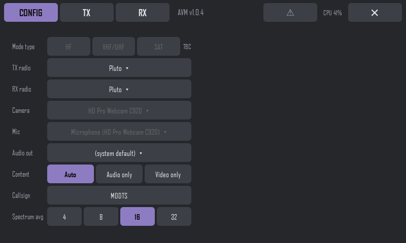

# AVM: Audio Video Modem

> **⚠ Experimental release.** AVM is a work in progress: expect rough edges,
> changes between versions (including on-air format changes, so both ends may
> need the same version), and the odd bug. Please report problems, and don't
> rely on it for anything that matters yet.

AVM sends **live video and audio over a narrow radio channel**, using
low-cost SDR hardware. Point a camera at something at one end, and the
picture and sound appear at the other, with a station callsign, carried by a
digital OFDM modem 20 to 250 kHz wide.

It's a complete station in one program, with a full-screen touch interface.
It's built to run on a **Raspberry Pi 4 with a 7" touch screen**, which can
transmit and receive at the same time. It also runs on an ordinary 64-bit
Linux PC (Ubuntu or Debian); see [Which platform?](#which-platform) before
choosing.

> **This is communications quality, not HD!** Think small, low-frame-rate
> pictures (at most 384×224, typically around 10 fps) and clear speech: good
> enough to see who's there and what they're showing you, over a channel a
> fraction of the width of normal DATV. It's not for watching TV.

## What it's for

Amateur digital TV (DATV) usually needs several MHz of spectrum and fast
hardware. AVM squeezes a small, low-frame-rate picture and clear audio into a
channel tens of kHz wide. That opens up uses where wide DATV doesn't fit:

- **Narrowband amateur video** on VHF/UHF bands where a wide signal isn't
  practical or allowed: pictures as well as voice.
- **Difficult paths:** the robust modes keep working through multipath and
  fading. Mode VU is aimed at VHF/UHF mobile and troposcatter (beyond the
  horizon) links.
- **Portable, field and emergency links:** a Pi, a small SDR and a camera
  make a self-contained station, and an RTL-SDR dongle is enough to receive.
- **Experimenting:** modes, widths, modulation, codecs and the radio are all
  selectable live, with signal quality shown as you go.

The data rate depends on the width and mode. It ranges from about 10 kbps
(20 kHz, the most robust settings) to over 100 kbps (250 kHz). For example,
mode VU at 80 kHz with QPSK carries about 45 kbps: 352×192 video at 10 fps
plus Codec2 audio. That's communications quality, not HD. When the settings
leave no room for video, AVM sends audio only and says so.

### Designed for HF and unstable VHF/UHF paths

AVM's multi-carrier (OFDM) modes are built for channels that fight back:
multipath, fading, Doppler and drift on HF, and on VHF/UHF mobile and
troposcatter paths. That's where they earn their keep.

On a clean, steady path, such as a **satellite link (QO-100 and the like),
DVB-S2 is much better**: a single-carrier system is more power-efficient
there, and well-established DATV gear does it properly. AVM works over a
satellite (some have tried it on QO-100, and the RX frequency offset helps
with LNB drift), but it isn't what it's designed for. That said, we're radio
amateurs and we're allowed to experiment! A single-carrier satellite mode
may be added later.

## The screens

The tabs along the top switch between **CONFIG**, **TX** and **RX**. TX and
RX both run at once; the tabs only change what you see. The title bar also
shows the version, the ⚠ errors list, CPU use and **✕** to quit.

### Config



The set-up choices, which rarely change once a station is running:

1. **Mode type:** HF, VHF/UHF or SAT. Not available yet (TBC).
2. **TX radio:** Pluto or LimeSDR. A LimeSDR also gets an antenna-port button
   (Auto, BAND1 or BAND2); on a LimeSDR Mini, try the other band if there's
   no RF output.
3. **RX radio:** Pluto, LimeSDR, RTL-SDR, Airspy or SDRplay, from the radios connected now. A
   Pluto shows how it's connected (**USB** or **IP**), and AVM uses the one
   you pick. An RTL-SDR also gets a **PPM** setting to correct its crystal,
   and a LimeSDR a port button (Auto, LNAL, LNAW or LNAH).
4. **Camera** and **Mic:** the capture devices (when TX's source is "Camera +
   mic").
5. **Audio out:** where received audio plays.
6. **Content:** what TX sends. **Auto** sends video whenever the link has room
   for it, otherwise audio only; **Audio only** and **Video only** force it.
7. **Callsign:** your callsign or a short message, sent with the picture.
8. **Spectrum avg:** how many measurements the RX spectrum averages (4, 8,
   16 or 32): higher is smoother, lower reacts faster. Applies live.

Changing any of these except Spectrum avg while transmitting or receiving
turns that tab's button to **RESTART TO APPLY**. Settings are saved as you
go.

### Transmit


1. **Preview:** exactly what's being sent (here the built-in test pattern).
   The first start on a new machine shows "Preparing video codec..." here
   instead, while the codec compiles.
2. **Rates:** video and audio bitrates, the link capacity, resolution and
   frame rate, the radio, and fragments sent.
3. **Source and resolution:** camera and mic, or the test pattern. Video sizes
   go from 192×112 up to 384×224.
4. **Audio:** Codec2 (3.2 kbps, leaves more room for video) or Opus (better
   quality).
5. **FPS:** video frame rate.
6. **Freq:** the transmit frequency.
7. **TX gain:** output level. It changes live while on air.
8. **Mode, kHz and Modul.:** how the signal is built. A–D are robust
   DRM-style modes, and VU is for VHF/UHF mobile and tropo. Widths go from
   20 to 250 kHz, with QPSK (robust) or 16QAM (faster). Narrow widths that a
   mode can't use are greyed out.
9. **TX button:** start and stop transmitting. It checks the radio is
   connected first, and shows **RESTART TO APPLY** if you change a setting
   that needs a restart.

### Receive


1. **Station:** the received callsign or message. It's shown with \*stars\*
   until it has been received intact.
2. **Video:** the received picture; tap it for full screen. A receiver
   tuning in mid-transmission sees the picture fill in as a mosaic within a
   few seconds.
3. **Lock lamps and status line:**
   - **Header** and **Frame** lamps, over the last 2 seconds: **green** when
     every fragment's header (or whole frame) decoded, **orange** when some
     did, **red** when none did.
   - **MER:** signal quality in dB; higher is better.
   - **CFO:** how far the transmitter is off frequency.
   - **fps:** received frame rate.
   - **Q:** video frames queued for display.
4. **Spectrum:** the live received band. Here it's a real mode VU, 80 kHz
   signal. The small notch in the middle is deliberate (an empty centre
   carrier), and it's handy for tuning. The **tuning indicator** behind the
   trace shows where the signal should sit for the selected mode and width:
   - **light blue band:** the signal's width, with a dashed centre line;
   - **green zones at each edge:** how far the signal can drift (the
     frequency-offset pull-in) and still lock without losing sensitivity.
     Tune so the signal's edges sit inside them.
5. **Freq and Offset:** the receive frequency, and a **−/+ offset** in 1 kHz
   steps (±100 kHz). The offset applies live, to pull an off-frequency
   signal (e.g. a drifting LNB on a satellite path) back into the green
   zones.
6. **Mode, kHz and Modul.:** these must match the transmitter.
7. **RX gain:** changes live.
8. **Ref level:** the spectrum's top line, or **Auto**.
9. **RX button:** start and stop receiving. It checks the radio is
   connected first, and says so if it isn't.

## How it works

```
camera ─► wavelet video codec ─┐                                  ┌─► video decoder ─► screen
                               ├─► framer ─► OFDM modem ─► SDR ~~► SDR ─► OFDM demodulator ─► deframer ─┤
mic ────► Opus / Codec2 ───────┘   (callsign, A/V sync)                                  └─► audio decoder ─► speaker
```

- **OFDM modem:** many closely spaced carriers, with pilots for tracking,
  LDPC error correction, and a preamble so a receiver can lock on at any
  time. Its timings are modelled on DRM's robustness modes, plus the
  VHF/UHF mode VU.
- **Video codec:** a wavelet codec written for AVM. It produces a fixed
  number of bytes per frame, so it fits the radio's capacity exactly, and it
  gets blurrier, not blocky, as the rate drops. A rolling refresh lets late
  joiners and lost data recover within a few seconds.
- **Receiver:** plays video and audio in step, at low latency. It skips ahead
  instead of falling behind if it's ever delayed.

## What you need

- **A computer:** see [Computers](#computers) below.
- **A radio (SDR):** see [Radios](#radios) below. Add filters and an
  amplifier as needed for your band.
- **A camera and microphone:** any USB webcam works (e.g. a Logitech C920,
  whose focus AVM can control). The test pattern needs no camera.
- **A licence to transmit:** see the note under [Use](#use).

## Supported hardware

AVM is an experimental release: "tested" below means it has been used with
AVM, not that every setting has been tried on it.

### Computers

| Computer | Notes |
|---|---|
| **Raspberry Pi 4** (64-bit Raspberry Pi OS) | The main platform: what AVM is developed and tested on. Best with the 7" touch screen. |
| **64-bit PC** (Ubuntu 22.04+, Debian 12+) | Works; a faster CPU allows bigger video. Expect to sort out the odd problem yourself (see [Which platform?](#which-platform)). |
| **Minimal Debian on 8 GB** | Works, with care: see [Small machines](#small-machines-minimal-debian-on-8-gb). |

### Radios

| Radio | TX | RX | Tuning range | Status | Notes |
|---|:-:|:-:|---|---|---|
| **ADALM-Pluto** | ✓ | ✓ | 70-6000 MHz* | Tested | TX and RX at once from one Pluto. On USB, or on the network at 192.168.2.1 / pluto.local. |
| **LibreSDR** (and other boards running Pluto firmware) | ✓ | ✓ | 70-6000 MHz | Untested | Works as a Pluto. On Ethernet, AVM checks both 192.168.2.1 and 192.168.1.10 (LibreSDR's default) and uses whichever answers. |
| **LimeSDR-USB / LimeSDR Mini** | ✓ | ✓ | 0.1-3800 MHz | Tested | TX **or** RX, not both at once from one Lime (it can only be opened by one program). To do both, add a second radio for RX, e.g. an RTL-SDR. AVM says "LimeSDR busy" otherwise. Antenna port selectable. |
| **RTL-SDR dongle** (RTL2832U + R820T) | | ✓ | 24-1766 MHz | Tested | Cheap RX. PPM setting to correct its crystal. |
| **Airspy R2 / Mini** | | ✓ | 24-1800 MHz | Found by AVM, receive not yet tested | Samples at 2.5 MS/s (R2) or 3 MS/s (Mini): more CPU on a Pi than an RTL-SDR. |
| **Airspy HF+ Discovery / Dual** | | ✓ | 0.01-31 and 60-260 MHz | Untested | Runs its own AGC: AVM's RX gain setting doesn't apply. |
| **SDRplay RSP1, RSP1A, RSP1B, RSP2, RSPduo, RSPdx, RSPdx-R2** | | ✓ | 0.001-2000 MHz | RSPduo found and opened by AVM, receive not yet tested | Needs SDRplay's API, which you download yourself: see [SDRplay RSPs](#sdrplay-rsps). Runs its own AGC. RSPduo used as a single tuner. |

\* 70-6000 MHz with the common Pluto firmware change; a stock Pluto covers
325-3800 MHz.

Radios are listed in AVM by what's plugged in now; a radio that isn't
connected isn't offered. AVM checks the chosen radio is there before TX or RX
starts, and pauses TX/RX if a USB radio disappears, carrying on when it's
back.

## Install

### Which platform?

**A Raspberry Pi 4 is the recommended way to run AVM.** It's what AVM is
developed and tested on, and the installer is made for a fresh 64-bit
Raspberry Pi OS card. If you already have a Portsdown
DATV station, it has the right hardware (a Pi 4 with the 7" touch screen and
a Pluto or LimeSDR). Just make a new SD card for AVM, and swap cards to
switch between Portsdown and AVM.

**A Linux PC or distribution you've set up yourself will likely need some
work from you.** The installer handles the common cases, but every machine
differs: other SDR software already installed, a different ffmpeg
build, missing drivers, sound and camera setups. It isn't possible to
support every combination, so on these, expect to sort out the odd problem
yourself.

### Installing

**Linux (Ubuntu 22.04+, Debian 12+, Raspberry Pi OS, 64-bit):**

```bash
wget https://raw.githubusercontent.com/m0dts/avm/main/install_avm.sh
bash install_avm.sh
```

First it checks the machine and lists what's already there, with versions
and anything it would install or change. Nothing is touched until you answer
**y**. It then downloads AVM into `~/avm` and installs what's missing. It
keeps SDR drivers your system already has, e.g. on DragonOS. It also adds an
**AVM** icon to the menu and desktop, and an `avm` command. Run it again with
`--update` to get the latest version, or `--check` to just see the report.

AVM's version (1.0.x, going up by one each release) shows in its title bar,
and in the [VERSION](VERSION) file here.

The first transmit or receive after installing takes a minute or two while
the modem and codec are compiled for your machine; on a slow CPU it can take
several minutes. The TX preview shows "Preparing video codec..." meanwhile.
After that, starts are quick.

### SDRplay RSPs

An SDRplay RSP needs SDRplay's own **API**: a background service that talks
to the radio. It isn't part of any Linux distribution and AVM can't download
it for you, because you have to accept SDRplay's licence. Get it yourself,
then AVM's installer does the rest (Linux only).

1. **Download the API for Linux** from
   [sdrplay.com/api](https://www.sdrplay.com/api/). It's one file, e.g.
   `SDRplay_RSP_API-Linux-3.15.2.run`, for PCs and for the Raspberry Pi
   (64- and 32-bit) alike.
2. **Put it where the installer looks:** on a USB drive plugged into the
   machine, in `~/Downloads`, or in the `~/avm` folder.
3. **Run AVM's installer at the machine itself**, not with `--yes`, so you
   can answer the licence:

   ```bash
   bash ~/avm/install_avm.sh
   ```

   Answer **y** to "SDRplay API ... found: install it?". SDRplay's installer
   then runs:
   - press **RETURN** to show the licence;
   - **space** to page through it, or **q** to skip to the end;
   - **y** to accept;
   - **y** to keep the default install locations.

   AVM's installer then builds the SoapySDR driver for SDRplay
   (SoapySDRPlay3, a minute or two on a Pi) and carries on.
4. **Pick the RSP** as the RX radio, e.g. **SDRplay RSP1A 090A1B**.

**If you install SDRplay's API another way**, e.g. by running the `.run`
file yourself, just run AVM's installer afterwards: it sees the API and
builds the driver.

**Updates:** AVM's Update button and `--yes` never install or upgrade
SDRplay's API, as its licence needs you there. To upgrade it, bring a newer
`.run` file and run the installer as in step 3: it offers the upgrade only
when the file is newer than what's installed, and rebuilds the driver.

**Things to know:**
- **RX gain:** the RSP runs its own AGC, so AVM's RX gain setting does
  nothing with it.
- **Sample rate:** AVM uses the lowest rate the RSP offers that fits, e.g.
  768 kS/s at the 160 and 250 kHz widths, so it's light on a Pi.
- **RSPduo:** it's used as a single tuner and listed once. Other programs
  (and `SoapySDRUtil --find`) list it four times, once per mode; that's
  normal.
- **One program at a time:** close other SDR software using the RSP (SDR++,
  CubicSDR...) before starting RX.
- **Checking it:** `SoapySDRUtil --find="driver=sdrplay"` should list the
  RSP. If not, check SDRplay's service is running with
  `systemctl status sdrplay`, and restart it with
  `sudo systemctl restart sdrplay`.
- **Windows:** AVM's installer doesn't set up SDRplay there. Installing
  SDRplay's Windows API and a SoapySDRPlay3 module by hand may work, but it
  hasn't been tested.

## Small machines: minimal Debian on 8 GB

AVM doesn't need a desktop, only an X server for its full-screen window. A
full desktop such as LXQt takes about 4 GB, which leaves too little room on
an 8 GB card or disk. Without one, Debian 13 plus AVM uses about 4.8 GB of a
5.8 GB root partition, leaving roughly 0.7 GB free. That's from a working
system with an Intel Atom x5 (4 cores, 1 GHz).

1. **Install Debian (netinstall), 64-bit.** At "Software selection", untick
   every desktop environment and tick only **SSH server** and **standard
   system utilities**.
2. **Give your user sudo**, if you set a root password during install:

   ```bash
   su -                                   # root's password; note the "-"
   apt-get install -y sudo && usermod -aG sudo YOURNAME
   exit
   ```

   Then log out and back in.
3. **Install a minimal X server** (about 100–150 MB):

   ```bash
   sudo apt install --no-install-recommends xserver-xorg-core xserver-xorg-input-libinput xinit openbox x11-xserver-utils
   ```

4. **Install AVM** with the Linux commands above. On a system like this,
   the installer also sets up the Pluto's USB network link, so the Pluto
   answers at 192.168.2.1.
5. **Start AVM full-screen with `startx`.** Create `~/.xinitrc`:

   ```bash
   xset s off -dpms s noblank        # no screen blanking
   openbox &
   cd ~/avm
   export HF_RX_GUI_LOG=$HOME/avm/gui_logs/rx_session.log
   exec ~/venv/bin/python touch_gui.py
   ```

   Run `startx`, and AVM fills the screen. Quitting AVM returns you to the
   console.
6. **Optional: start AVM at power-on.** Run
   `sudo systemctl edit getty@tty1` and add the following, with your
   username in place of YOURNAME:

   ```
   [Service]
   ExecStart=
   ExecStart=-/sbin/agetty --autologin YOURNAME --noclear %I $TERM
   ```

   Then add this line to the end of `~/.bash_profile`:

   ```bash
   [ -z "$DISPLAY" ] && [ "$(tty)" = /dev/tty1 ] && exec startx
   ```

Notes:

- With no desktop, there's no PulseAudio or PipeWire. AVM plays and records
  through ALSA directly, so pick the devices in AVM's audio settings.
- To find the machine's address for SSH, run `hostname -I` on it.
- Keep `sudo apt clean` handy: apt's download cache can eat the last few
  hundred MB.
- A slow CPU compiles the codec slowly on first use, and it also limits live
  video. Use a lower resolution or frame rate if the video stutters.

## Use

1. Plug in your radio and start AVM.
2. **TX page:** pick the radio, frequency, mode and width, then the camera and
   microphone (or the test pattern), and press **TX**.
3. **RX page:** set the same frequency, mode and width, and press **RX**.

Both ends must use the same mode, width and modulation.

**Mode VU changed in October 2026:** its preamble is now twice as long, so
weak signals are found reliably (about 1 dB better at 80 kHz). Stations on
older versions can't receive
the new VU and vice versa, so update both ends to use VU (modes A–D are
unaffected).

If a radio or camera drops off USB while running (a loose cable, a device
browning out), AVM stops that side, says which device went, and restarts
it by itself once the device is back. If every USB device disappears at
once, the computer's USB has failed: the title bar says so, and only a
reboot brings it back. On a Raspberry Pi, use good short cables and a
powered hub for power-hungry radios like the LimeSDR.

Transmitting requires an appropriate licence (e.g. an amateur radio
licence), and you must stay within your band and power limits.

## Author

Rob, M0DTS.

AVM is AI-generated: it was written by Claude (Anthropic's AI), instructed,
tested and steered by M0DTS.
