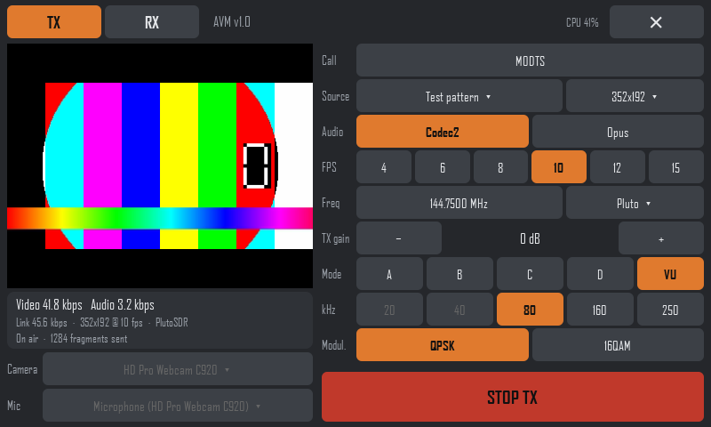
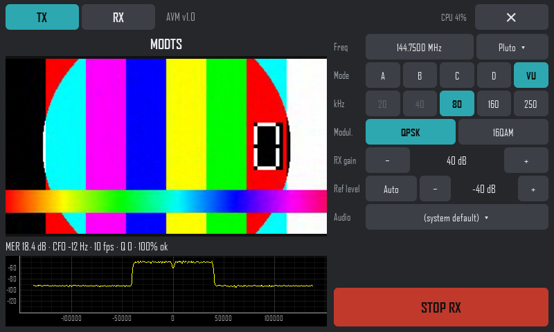

# AVM: Audio Video Modem

AVM sends **live video and audio over a narrow radio channel**, using
low-cost SDR hardware. Point a camera at something at one end, and the
picture and sound appear at the other, with a station callsign, carried by a
digital OFDM modem 20 to 250 kHz wide.

It's a complete station in one program, with a full-screen touch interface.
It's built to run on a **Raspberry Pi 4 with a 7" touch screen**, which can
transmit and receive at the same time. It also runs on an ordinary 64-bit
Linux PC (Ubuntu or Debian); see [Which platform?](#which-platform) before
choosing.

> **This is communications quality, not HD!** Think small, low-frame-rate
> pictures (at most 384×224, typically around 10 fps) and clear speech: good
> enough to see who's there and what they're showing you, over a channel a
> fraction of the width of normal DATV. It's not for watching TV.

## What it's for

Amateur digital TV (DATV) usually needs several MHz of spectrum and fast
hardware. AVM squeezes a small, low-frame-rate picture and clear audio into a
channel tens of kHz wide. That opens up uses where wide DATV doesn't fit:

- **Narrowband amateur video** on VHF/UHF bands where a wide signal isn't
  practical or allowed: pictures as well as voice.
- **Difficult paths:** the robust modes keep working through multipath and
  fading. Mode VU is aimed at VHF/UHF mobile and troposcatter (beyond the
  horizon) links.
- **Portable, field and emergency links:** a Pi, a small SDR and a camera
  make a self-contained station, and an RTL-SDR dongle is enough to receive.
- **Experimenting:** modes, widths, modulation, codecs and the radio are all
  selectable live, with signal quality shown as you go.

The data rate depends on the width and mode. It ranges from about 10 kbps
(20 kHz, the most robust settings) to over 100 kbps (250 kHz). For example,
mode VU at 80 kHz with QPSK carries about 45 kbps: 352×192 video at 10 fps
plus Codec2 audio. That's communications quality, not HD. When the settings
leave no room for video, AVM sends audio only and says so.

## The screens

### Transmit



1. **TX / RX tabs.** Both run at once; the tabs switch what you see. The
   title bar shows the version and CPU use; **✕** quits.
2. **Preview:** exactly what's being sent (here the built-in test pattern).
   The first start on a new machine shows "Preparing video codec..." here
   instead, while the codec compiles.
3. **Rates:** video and audio bitrates, the link capacity, resolution and
   frame rate, the radio, and fragments sent.
4. **Camera and Mic** (when the source is "Camera + mic").
5. **Call:** your callsign or a short message, sent with the picture.
6. **Source and resolution:** camera and mic, or the test pattern. Video sizes
   go from 192×112 up to 384×224.
7. **Audio:** Codec2 (3.2 kbps, leaves more room for video) or Opus (better
   quality).
8. **FPS:** video frame rate.
9. **Freq and radio:** the transmit frequency, and Pluto or LimeSDR. With a
   LimeSDR, a third button picks its antenna port (Auto, BAND1 or BAND2).
   On a LimeSDR Mini, try the other band if there's no RF output.
10. **TX gain:** output level. It changes live while on air.
11. **Mode, kHz and Modul.:** how the signal is built. A–D are robust
    DRM-style modes, and VU is for VHF/UHF mobile and tropo. Widths go from
    20 to 250 kHz, with QPSK (robust) or 16QAM (faster). Narrow widths that a
    mode can't use are greyed out.
12. **TX button:** start and stop transmitting. It turns amber if you change
    a setting that needs a restart.

### Receive



1. **Station:** the received callsign or message. It's shown with \*stars\*
   until it has been received intact.
2. **Video:** the received picture; tap it for full screen. A receiver
   tuning in mid-transmission sees the picture fill in as a mosaic within a
   few seconds.
3. **Status line:**
   - **MER:** signal quality in dB; higher is better.
   - **CFO:** how far the transmitter is off frequency.
   - **fps:** received frame rate.
   - **Q:** video frames queued for display.
   - **% ok:** the share of data blocks received correctly.
4. **Spectrum:** the live received band. Here it's a real mode VU, 80 kHz
   signal. The small notch in the middle is deliberate (an empty centre
   carrier), and it's handy for tuning.
5. **Freq and radio:** the receive frequency, and Pluto, LimeSDR or RTL-SDR.
   An RTL-SDR also gets a PPM row to correct its crystal, and a LimeSDR a
   port button (Auto, LNAL, LNAW or LNAH).
6. **Mode, kHz and Modul.:** these must match the transmitter.
7. **RX gain:** changes live.
8. **Ref level:** the spectrum's top line, or **Auto**.
9. **Audio:** the output device.
10. **RX button:** start and stop receiving.

## How it works

```
camera ─► wavelet video codec ─┐                                  ┌─► video decoder ─► screen
                               ├─► framer ─► OFDM modem ─► SDR ~~► SDR ─► OFDM demodulator ─► deframer ─┤
mic ────► Opus / Codec2 ───────┘   (callsign, A/V sync)                                  └─► audio decoder ─► speaker
```

- **OFDM modem:** many closely spaced carriers, with pilots for tracking,
  LDPC error correction, and a preamble so a receiver can lock on at any
  time. Its timings are modelled on DRM's robustness modes, plus the
  VHF/UHF mode VU.
- **Video codec:** a wavelet codec written for AVM. It produces a fixed
  number of bytes per frame, so it fits the radio's capacity exactly, and it
  gets blurrier, not blocky, as the rate drops. A rolling refresh lets late
  joiners and lost data recover within a few seconds.
- **Receiver:** plays video and audio in step, at low latency. It skips ahead
  instead of falling behind if it's ever delayed.

## What you need

- **A computer:** a Raspberry Pi 4, or any 64-bit PC running Ubuntu or
  Debian Linux. A faster CPU allows bigger video.
- **A radio (SDR):**
  - **ADALM-Pluto:** TX and RX, both at once from one Pluto.
  - **LimeSDR (USB or Mini):** TX or RX, but not both at once from one
    LimeSDR. AVM runs TX and RX as separate programs, and a Lime can only be
    opened by one of them at a time. To transmit and receive together, pair
    the Lime with a second radio for RX, such as a cheap RTL-SDR. AVM says
    "LimeSDR busy" if you try to use one for both.
  - **RTL-SDR dongle:** RX only.

  Add filters and an amplifier as needed for your band.
- **A camera and microphone:** any USB webcam works (e.g. a Logitech C920,
  whose focus AVM can control). The test pattern needs no camera.
- **A licence to transmit:** see the note under [Use](#use).

## Install

### Which platform?

**A Raspberry Pi 4 is the recommended way to run AVM.** It's what AVM is
developed and tested on, and the installer is made for a fresh 64-bit
Raspberry Pi OS card. If you already have a Portsdown
DATV station, it has the right hardware (a Pi 4 with the 7" touch screen and
a Pluto or LimeSDR). Just make a new SD card for AVM, and swap cards to
switch between Portsdown and AVM.

**A Linux PC or distribution you've set up yourself will likely need some
work from you.** The installer handles the common cases, but every machine
differs: other SDR software already installed, a different ffmpeg
build, missing drivers, sound and camera setups. It isn't possible to
support every combination, so on these, expect to sort out the odd problem
yourself.

### Installing

**Linux (Ubuntu 22.04+, Debian 12+, Raspberry Pi OS, 64-bit):**

```bash
wget https://raw.githubusercontent.com/m0dts/avm/main/install_avm.sh
bash install_avm.sh
```

First it checks the machine and lists what's already there, with versions
and anything it would install or change. Nothing is touched until you answer
**y**. It then downloads AVM into `~/avm` and installs what's missing. It
keeps SDR drivers your system already has, e.g. on DragonOS. It also adds an
**AVM** icon to the menu and desktop, and an `avm` command. Run it again with
`--update` to get the latest version, or `--check` to just see the report.

It also asks whether to **turn the screen upside down**, for a touch screen
mounted the other way up: AVM then rotates the picture and the touch input
180° while it runs, and puts them back when it quits. Answer later with
`bash ~/avm/install_avm.sh --rotate180` (or `--no-rotate`).

The first transmit or receive after installing takes a minute or two while
the modem and codec are compiled for your machine; on a slow CPU it can take
several minutes. The TX preview shows "Preparing video codec..." meanwhile.
After that, starts are quick.

## Small machines: minimal Debian on 8 GB

AVM doesn't need a desktop, only an X server for its full-screen window. A
full desktop such as LXQt takes about 4 GB, which leaves too little room on
an 8 GB card or disk. Without one, Debian 13 plus AVM uses about 4.8 GB of a
5.8 GB root partition, leaving roughly 0.7 GB free. That's from a working
system with an Intel Atom x5 (4 cores, 1 GHz).

1. **Install Debian (netinstall), 64-bit.** At "Software selection", untick
   every desktop environment and tick only **SSH server** and **standard
   system utilities**.
2. **Give your user sudo**, if you set a root password during install:

   ```bash
   su -                                   # root's password; note the "-"
   apt-get install -y sudo && usermod -aG sudo YOURNAME
   exit
   ```

   Then log out and back in.
3. **Install a minimal X server** (about 100–150 MB):

   ```bash
   sudo apt install --no-install-recommends xserver-xorg-core xserver-xorg-input-libinput xinit openbox x11-xserver-utils
   ```

4. **Install AVM** with the Linux commands above. On a system like this,
   the installer also sets up the Pluto's USB network link, so the Pluto
   answers at 192.168.2.1.
5. **Start AVM full-screen with `startx`.** Create `~/.xinitrc`:

   ```bash
   xset s off -dpms s noblank        # no screen blanking
   openbox &
   cd ~/avm
   export HF_RX_GUI_LOG=$HOME/avm/gui_logs/rx_session.log
   exec ~/venv/bin/python touch_gui.py
   ```

   Run `startx`, and AVM fills the screen. Quitting AVM returns you to the
   console.
6. **Optional: start AVM at power-on.** Run
   `sudo systemctl edit getty@tty1` and add the following, with your
   username in place of YOURNAME:

   ```
   [Service]
   ExecStart=
   ExecStart=-/sbin/agetty --autologin YOURNAME --noclear %I $TERM
   ```

   Then add this line to the end of `~/.bash_profile`:

   ```bash
   [ -z "$DISPLAY" ] && [ "$(tty)" = /dev/tty1 ] && exec startx
   ```

Notes:

- With no desktop, there's no PulseAudio or PipeWire. AVM plays and records
  through ALSA directly, so pick the devices in AVM's audio settings.
- To find the machine's address for SSH, run `hostname -I` on it.
- Keep `sudo apt clean` handy: apt's download cache can eat the last few
  hundred MB.
- A slow CPU compiles the codec slowly on first use, and it also limits live
  video. Use a lower resolution or frame rate if the video stutters.

## Use

1. Plug in your radio and start AVM.
2. **TX page:** pick the radio, frequency, mode and width, then the camera and
   microphone (or the test pattern), and press **TX**.
3. **RX page:** set the same frequency, mode and width, and press **RX**.

Both ends must use the same mode, width and modulation.

**Mode VU changed in October 2026:** its preamble is now twice as long, so
weak signals are found reliably (about 1 dB better at 80 kHz). Stations on
older versions can't receive
the new VU and vice versa, so update both ends to use VU (modes A–D are
unaffected).

If a radio or camera drops off USB while running (a loose cable, a device
browning out), AVM stops that side, says which device went, and restarts
it by itself once the device is back. If every USB device disappears at
once, the computer's USB has failed: the title bar says so, and only a
reboot brings it back. On a Raspberry Pi, use good short cables and a
powered hub for power-hungry radios like the LimeSDR.

Transmitting requires an appropriate licence (e.g. an amateur radio
licence), and you must stay within your band and power limits.

## Author

Rob, M0DTS
